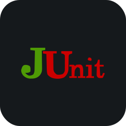
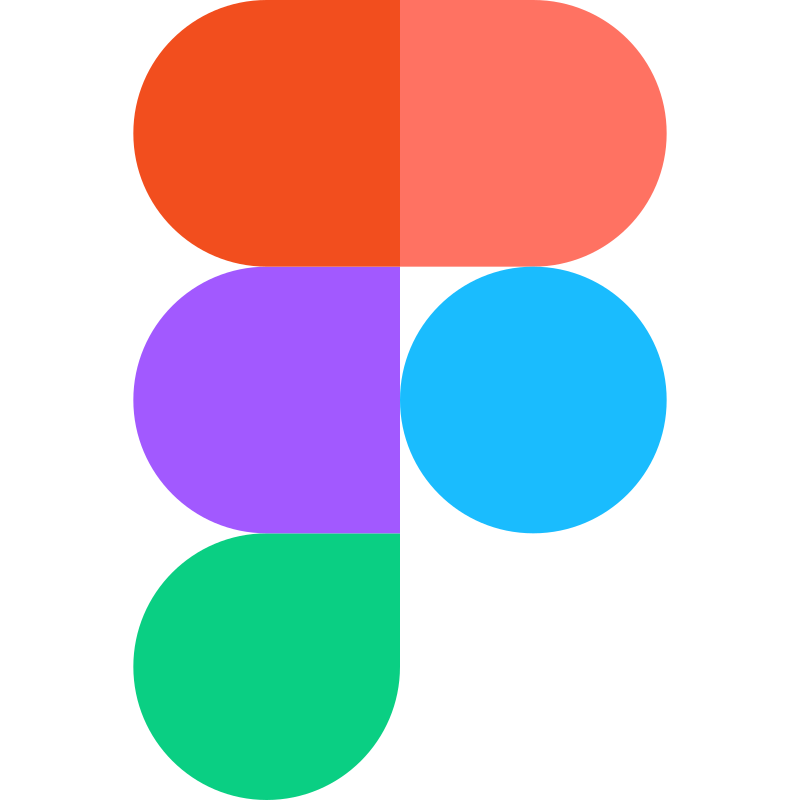
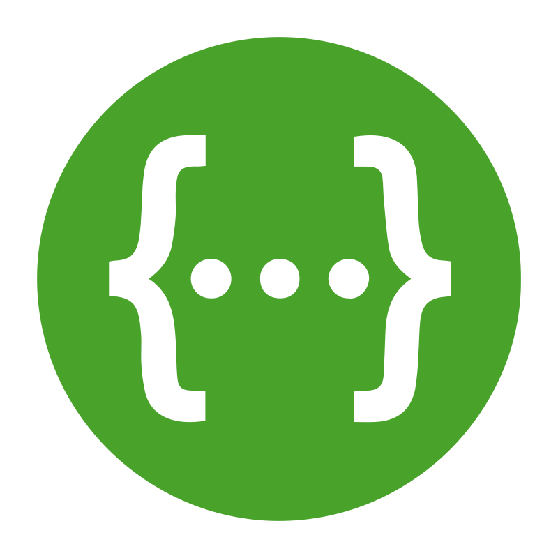

# About

- 👋 Привет, я Ринат Ибрагимов или @r1nple
- 🔰 Начинающий Fullstack (Java) инженер по тестированию
- 👀 Интересует всё, что связано с тестированием
- 👨‍🎓 Учился в Яндекс Практикум (2025/2026)

# Стэк
           

# Контакты
📧<a href="mailto:rinatalbertovich@yandex.ru">Email</a> &nbsp;&nbsp;&nbsp;&nbsp;&nbsp; 📱<a href="https://t.me/r1nple">Telegram</a>
